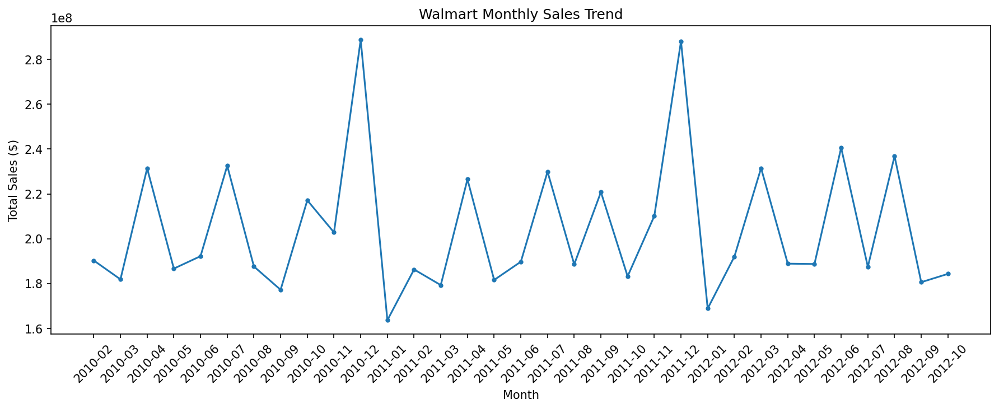
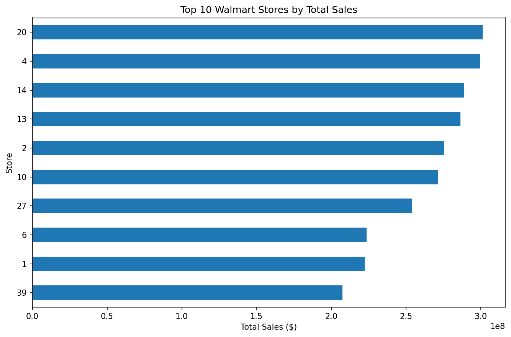
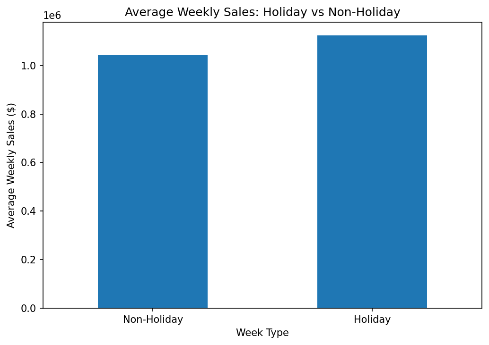
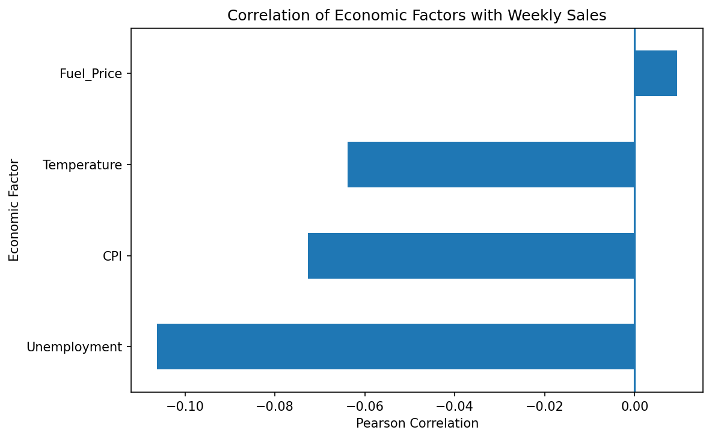

# Walmart Sales Analytics

This project analyzes historical Walmart weekly sales data to understand store performance, holiday sales patterns, monthly trends, and the relationship between economic factors and sales.

I used Python for data preparation and exploratory analysis, and SQLite to answer business questions using SQL.

## Dataset

The dataset contains 6435 weekly sales records across 45 stores from February 2010 to October 2012.

The data includes:

- Store
- Date
- Weekly Sales
- Holiday Flag
- Temperature
- Fuel Price
- CPI
- Unemployment

During data preparation, I checked for missing values and duplicates, converted the date field to datetime format, and created additional year and month fields for trend analysis.

## Tools Used

- Python
- Pandas
- Matplotlib
- SQLite
- SQL
- Google Colab

## Analysis

The analysis focused on:

- Overall sales performance
- Top-performing stores
- Holiday vs. non-holiday sales
- Monthly sales trends
- Store contribution to total sales
- Economic factors and their correlation with weekly sales
- Store ranking using SQL window functions
- Month-over-month sales changes using SQL

## Key Findings

- Total sales across the dataset were approximately **$6.74 billion**.
- The top five stores generated approximately **$1.45 billion**, representing **21.55% of total sales**.
- **Store 20** had the highest total sales at approximately **$301.40 million**.
- Average store-week sales during holiday periods were approximately **$1.12 million**, compared with **$1.04 million** during non-holiday periods, a **7.84% higher average**.
- **December 2010** recorded the highest aggregate monthly sales at approximately **$288.76 million**.
- Fuel price, temperature, CPI, and unemployment individually showed weak linear correlations with weekly sales.

## Visualizations

### Monthly Sales Trend

### Top 10 Stores by Total Sales

### Holiday vs. Non-Holiday Sales

### Economic Factors and Weekly Sales

## SQL Analysis

I used SQLite to perform the SQL portion of the analysis. The queries include aggregations, grouping, CASE statements, CTEs, subqueries, and window functions such as `RANK()` and `LAG()`.

The standalone SQL queries are available in:

`walmart_sales_analysis.sql`

The SQL notebook is available in:

`walmart_sales_sql_analysis.ipynb`

## Project Files

- `walmart_sales_analysis.ipynb` - Python data preparation and analysis
- `walmart_sales_sql_analysis.ipynb` - SQL analysis performed using SQLite in Google Colab
- `walmart_sales_analysis.sql` - Standalone SQL queries
- `walmart_sales_cleaned.csv` - Prepared dataset used for analysis
- `assets/` - Charts generated during the analysis

## What I Learned

This project helped me practice working through a complete analytics workflow: validating and preparing raw data, exploring business questions with Python, using SQL to reproduce and extend the analysis, and communicating the results through visualizations and quantified findings.
